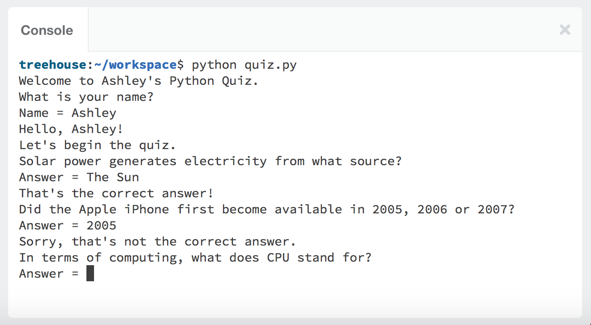

# python-quiz

A console-based quiz application written in Python.

## Summary:

This console-based quiz application asks the user questions, collects and evaluates the user’s answers and tells the user whether they are right, wrong or, on certain questions, close.

At the end of the quiz, the user is told how many questions they answered correctly and, if they fall within range, they are awarded a medal.

I wrote the quiz in Python 3 using lists, functions and loops to reduce code repetition, improve readability and allow changes to be made more easily.
